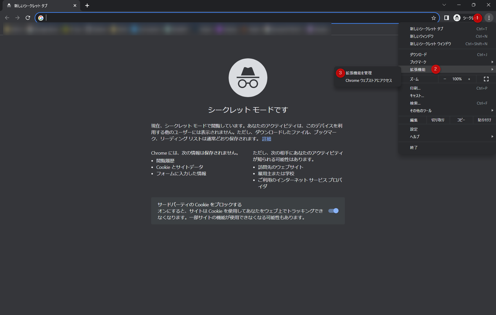
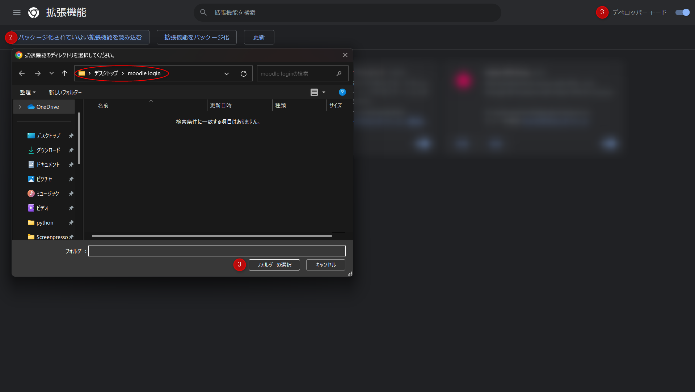
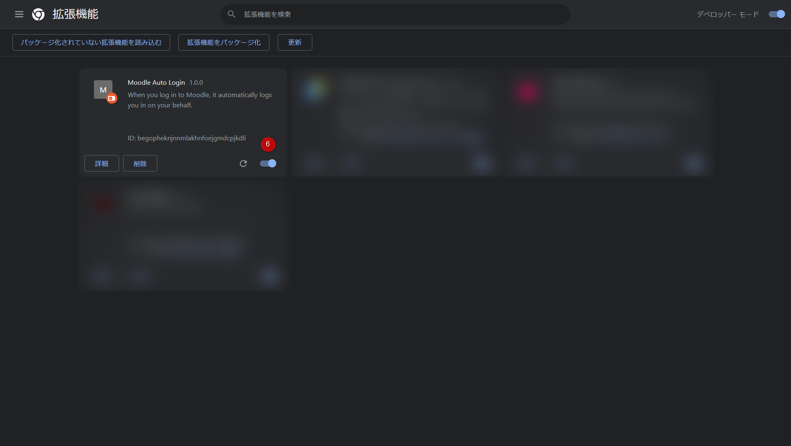

# AutoLoginForMoodle
When you log in to Moodle, it automatically logs you in on your behalf.

Moodleにログインを要求されたとき自動でログイン処理を行ってくれるchrome拡張機能です。  

使い方は下記の手順1・手順2で説明しています。

# 手順１

(1)：ソースコードをダウンロードする。右上の緑色の[Code] > [Download ZIP]をクリックするとソースコードがzipファイルとしてダウンロードされます。ダウンロード完了後にフォルダを解凍してください。  

(2)：デスクトップなどパソコン内にフォルダを新規作成してください。  

(3)：作成したフォルダ内に解凍したフォルダの中から「content.js」と「manifest.json」をコピペしてください。  

(4)：「content.js」をメモ帳などのテキストエディタで開いてください。1行目の「gp23a000」という部分を自分の学生番号に、2行目の「your password」という部分を自分のmoodleのパスワードに書き換えて保存してください。  

# 手順２

(1)chrome拡張機能の管理画面を開く

(2)手順1で作成したフォルダを指定する (※content.jsとmanifest.jsonは表示されない場合があります)

(3)chrome拡張機能を有効化する

